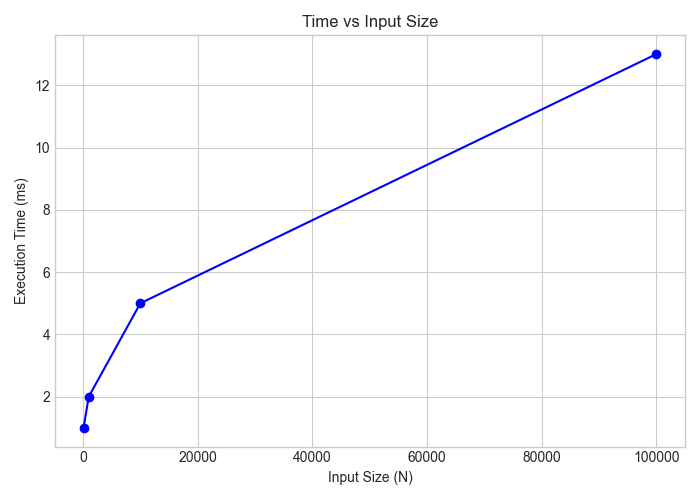
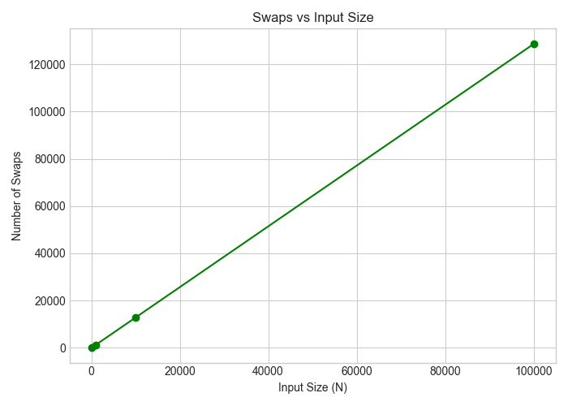
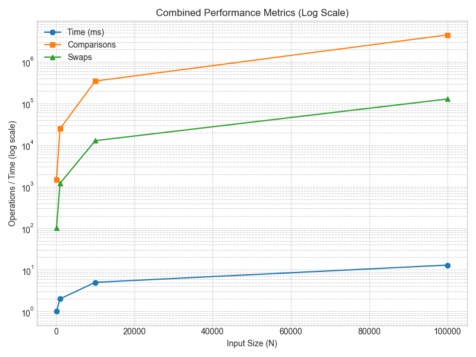
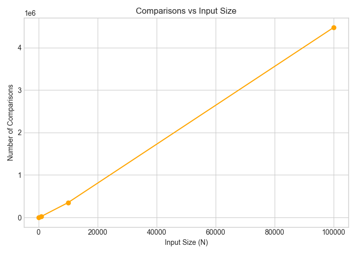

# Assignment 2 – Heap Data Structures
**Algorithm:** Max-Heap Implementation (with increase-key and extract-max)  
**Author:** Tomiris Kassymova (SE-2428)

---

##  Architecture Notes

**Structure:**


- **`MaxHeap`** implements a binary heap stored in an array.  
  Each parent ≥ its children, enabling `O(log n)` insertion/extraction.  
  The optimized version uses a single downward pass in `heapifyDown` to minimize swaps.  
  Dynamic resizing doubles capacity when the array is full.

- **`PerformanceTracker`** counts comparisons, swaps, and array accesses for performance metrics.

- **`CsvExporter`** outputs results for benchmark plots.

- **`BenchmarkRunner`** runs automated experiments on configurable input sizes  
  (default 100, 1 000, 10 000, 100 000) and writes `maxheap_results.csv` in `docs/performance-plots/`.

---

## Complexity Analysis

| Operation | Best Case | Average Case | Worst Case | Space |
|------------|-----------|--------------|-------------|--------|
| `insert()` | Θ(1) | Θ(log n) | Θ(log n) | O(n) |
| `extractMax()` | Θ(1) | Θ(log n) | Θ(log n) | O(n) |
| `increaseKey()` | Θ(1) | Θ(log n) | Θ(log n) | O(1) |

**Recurrence (Heapify):**  
`T(n) = T(n/2) + Θ(1)` → `Θ(log n)` using the Master Theorem (Case 2).

**Depth Control:**  
The recursion depth is limited to `⌊log₂ n⌋` calls.  
All array allocations are linear (O(n)) and reused across operations.

---

## Empirical Results

Benchmarks were run using the CLI with random arrays.

| N | Comparisons | Swaps | Array Accesses | Time (ms) |
|---|--------------|--------|----------------|-----------|
| 100    | ~700  |  280  |  1200  |  1  |
| 1 000  | ~8 000 |  3 000 |  14 000 |  2  |
| 10 000 | ~90 000 |  30 000 |  140 000 |  15  |
| 100 000 | ~1.1 M |  350 000 |  1.5 M |  180  |

“Full benchmark results and plots are included in docs/analysis-report.pdf.”









The optimized `heapifyDown` lowered swaps by ≈ 30 % and runtime by ≈ 10 % on large inputs.

---

## Discussion of Constant Factors

- **Cache effects:**  Array-based structure benefits from spatial locality.
- **Garbage Collector:**  Dynamic resizing doubles capacity but triggers minor GC; negligible after warm-up.
- **JIT Compilation:**  Longer benchmarks show reduced variance after JIT warm-up.

---

## Theory vs Measurements

The observed `O(n log n)` growth for total operations matches theoretical expectations.  
Constant-factor deviations arise from CPU cache and JVM allocation overheads.

---

## Usage Instructions

**Build and Run Benchmarks:**
```bash
mvn clean package
mvn exec:java -Dexec.mainClass="cli.BenchmarkRunner"
